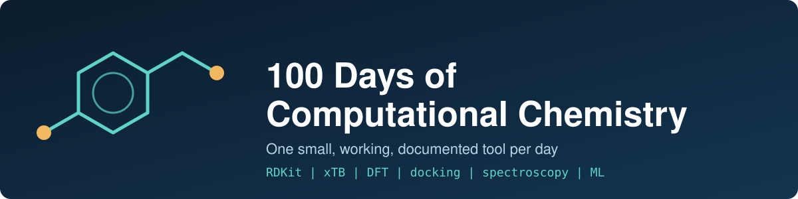

<p align="center">
  
</p>

# 100 Days of Computational Chemistry

**One small, working tool per day for chemistry students and researchers**  
Python · RDKit · xTB · free and open source (MIT)

[](https://github.com/asifverse4/100-days-of-computational-chemistry/actions/workflows/ci.yml)


[](LICENSE)

Each day adds one tool you can run in a minute: spectroscopy, DFT/xTB, docking/MD, synthesis analysis and machine learning. Every tool has a README that says what it does and why, a script, a tiny example and a test. They come from real lab and research workflows (N-doped carbon dots, DFT/xTB, docking/MD, chromene synthesis).

## What is in it so far

| Day | Tool | What it does | Try it |
|---|---|---|---|
| 2 | [SMILES to 3D](days/day02-smiles-to-3d/) | SMILES or a list of SMILES to optimized 3D `.xyz` files (RDKit, MMFF94/UFF) | `python tool.py example/input.smi --outdir out` |
| 3 | [Descriptors table](days/day03-descriptors-table/) | SMILES list to a CSV of MW, logP, TPSA, HBD/HBA, QED and Lipinski violations | `python tool.py example/input.smi -o descriptors.csv` |
| 4 | [xTB batch](days/day04-xtb-batch/) | Runs GFN-xTB optimizations on many molecules and collects energies, gaps and status in one CSV | `python tool.py example/input.smi --outdir out` |
| 5 | [xTB output parser](days/day05-xtb-output-parser/) | Collects energies, HOMO-LUMO gaps and atomic charges from xtb outputs into CSV, with conformer ranking | `python tool.py xtb_results -o summary.csv` |
| 6 | [XYZ toolkit](days/day06-xyz-toolkit/) | Inspect, split, merge, center and convert structure files (xyz, pdb, Turbomole coord) | `python tool.py info example/ethanol.xyz` |
| 7 | [Unit converter](days/day07-unit-converter/) | Convert hartree, eV, kcal/mol, kJ/mol, cm-1, nm, THz and K, for one value or a CSV column | `python tool.py 450 nm ev` |
| 8 | [Periodic table](days/day08-periodic-table/) | Look up element properties offline, list by group, period or block, and get molar masses of formulas | `python tool.py Fe` |

New tools land every day. The full plan is in [ROADMAP.md](ROADMAP.md).

## What it looks like

Day 3 on six molecules (`days/day03-descriptors-table/example/descriptors.csv`):

| name | formula | mw | logp | tpsa | hbd | hba | qed | lipinski_violations |
|---|---|---|---|---|---|---|---|---|
| ethanol | C2H6O | 46.07 | 0.0 | 20.23 | 1 | 1 | 0.407 | 0 |
| aspirin | C9H8O4 | 180.16 | 1.31 | 63.6 | 1 | 4 | 0.55 | 0 |
| ibuprofen | C13H18O2 | 206.28 | 3.07 | 37.3 | 1 | 2 | 0.822 | 0 |
| caffeine | C8H10N4O2 | 194.19 | -1.03 | 61.82 | 0 | 6 | 0.538 | 0 |
| chromone_amine | C9H7NO2 | 161.16 | 1.38 | 56.23 | 2 | 3 | 0.634 | 0 |

Day 2 prints one line per molecule and writes a `.xyz` file for each:
```
[ok] ethanol: 9 atoms, MMFF94 -1.34 kcal/mol -> example/output/ethanol.xyz
[ok] aspirin: 21 atoms, MMFF94 18.91 kcal/mol -> example/output/aspirin.xyz
```

These tools are free. If one saves you time, a coffee keeps the daily work going:

[](SUPPORT_THE_CREATOR.md)

## What you need

| | |
|---|---|
| **Python** | 3.11 or newer |
| **Packages** | `pip install -r requirements.txt` (RDKit, NumPy, SciPy, pandas, matplotlib, ASE) |
| **xTB** | only for Day 4 and the xTB days: `conda install -c conda-forge xtb` |
| **System** | Windows, Linux or macOS. xTB on Windows is easiest through WSL or conda |
| **Graphics card** | not needed |
| **Disk** | a few MB. Examples are tiny |

## Install

```bash
git clone https://github.com/asifverse4/100-days-of-computational-chemistry
cd 100-days-of-computational-chemistry
pip install -r requirements.txt
```

Then pick a day and run it from its folder:
```bash
cd days/day03-descriptors-table
python tool.py "CC(=O)Oc1ccccc1C(=O)O"        # one molecule, prints a table
python tool.py example/input.smi -o out.csv   # a list, writes a CSV
```

## Where do I start?

| I want to... | Use |
|---|---|
| turn a SMILES into a 3D structure for xTB, ORCA or Psi4 | [Day 2](days/day02-smiles-to-3d/) |
| screen a list of molecules before docking or QSAR | [Day 3](days/day03-descriptors-table/) |
| pre-optimize many structures with xTB | [Day 4](days/day04-xtb-batch/) |
| pull energies, gaps and charges out of xTB output files | [Day 5](days/day05-xtb-output-parser/) |
| split, merge, center or convert structure files | [Day 6](days/day06-xyz-toolkit/) |
| convert energies, wavelengths and wavenumbers (Eh, eV, kcal/mol, nm, cm-1) | [Day 7](days/day07-unit-converter/) |
| look up an element's mass, electronegativity or radius, or the molar mass of a formula | [Day 8](days/day08-periodic-table/) |
| plot UV-vis, Tauc, fluorescence or FTIR data | Days 11-19, coming |
| set up ORCA / Psi4 jobs and read DFT results | Days 21-30, coming |
| dock ligands and analyze MD | Days 31-40, coming |

## Roadmap at a glance

| Days | Phase | Ends with |
|---|---|---|
| 1-10 | Foundations and template | index page and CI |
| 11-20 | Nanomaterial and spectroscopy data | `spectra-kit` v0.1 |
| 21-30 | DFT and xTB workflows | `qc-workflows` v0.2 |
| 31-40 | Docking and MD | `dock-md-lite` v0.3 |
| 41-50 | Synthesis and green chemistry | `synth-lab-notebook` v0.4 |
| 51-60 | Machine learning for chemistry | `chem-ml-starter` v0.5 |
| 61-70 | Tools for students | `netjrf-chem-toolkit` v0.6 |
| 71-80 | Apps and visualization | `chem-apps` v0.7 |
| 81-90 | Quality and reproducibility | v1.0 release |
| 91-100 | Capstone worked examples | final summary |

## Something went wrong?

- **`ImportError: DLL load failed ... Application Control policy has blocked this file` on Windows.** Windows is blocking RDKit's compiled files. Use WSL or a conda environment instead, or run the tools in GitHub Codespaces.
- **`xtb executable not found`.** Install xTB (`conda install -c conda-forge xtb`) or pass `--xtb /path/to/xtb`.
- **A molecule is skipped with `Invalid SMILES`.** Check the SMILES, the tool reports the molecule name and carries on with the rest.
- **`pytest` imports the wrong `tool.py`.** Run tests one day at a time: `pytest days/day03-descriptors-table`. CI does the same.

Still stuck? Open an [issue](https://github.com/asifverse4/100-days-of-computational-chemistry/issues) and include the command you ran and the error text.

## How does it work?

- **One folder per day** under `days/dayNN-name/`: a `README.md` (what, why, how to run, limitations), a `tool.py`, a tiny `example/` and a test.
- **One command starts a new day:** `python tools/new_day.py 5 xtb-output-parser` copies the template, fills in the title and adds a row to the table below.
- **CI checks every push:** `ruff` for style, then `pytest` once per day folder.
- **Every tenth day ends in a mini release** that bundles that phase into a small package.

## Progress
| Day | Topic | Folder |
|-----|-------|--------|
| 1 | Repo setup | [`template/`](template/) |
| 2 | Smiles To 3D | [`days/day02-smiles-to-3d/`](days/day02-smiles-to-3d/) |
| 3 | Descriptors Table | [`days/day03-descriptors-table/`](days/day03-descriptors-table/) |
| 4 | xTB Batch | [`days/day04-xtb-batch/`](days/day04-xtb-batch/) |
| 5 | xTB Output Parser | [`days/day05-xtb-output-parser/`](days/day05-xtb-output-parser/) |
| 6 | XYZ Toolkit | [`days/day06-xyz-toolkit/`](days/day06-xyz-toolkit/) |
| 7 | Unit Converter | [`days/day07-unit-converter/`](days/day07-unit-converter/) |
| 8 | Periodic Table | [`days/day08-periodic-table/`](days/day08-periodic-table/) |

## Contributing
Issues and PRs are welcome. See [`CONTRIBUTING.md`](CONTRIBUTING.md) and the [Code of Conduct](CODE_OF_CONDUCT.md).

## Citation
If a tool helps your work, please cite it via [`CITATION.cff`](CITATION.cff). GitHub's "Cite this repository" button gives you BibTeX and APA.

## Support the creator
Everything here is free and will stay free. If it helps you, you can star the repo, share it, or [chip in](SUPPORT_THE_CREATOR.md).

## Credits and license
Built on [RDKit](https://www.rdkit.org), [xTB](https://github.com/grimme-lab/xtb), [ASE](https://wiki.fysik.dtu.dk/ase/), NumPy, SciPy, pandas and matplotlib. Day 8's element data comes from [mendeleev](https://github.com/lmmentel/mendeleev) (MIT). Released under the [MIT License](LICENSE).
